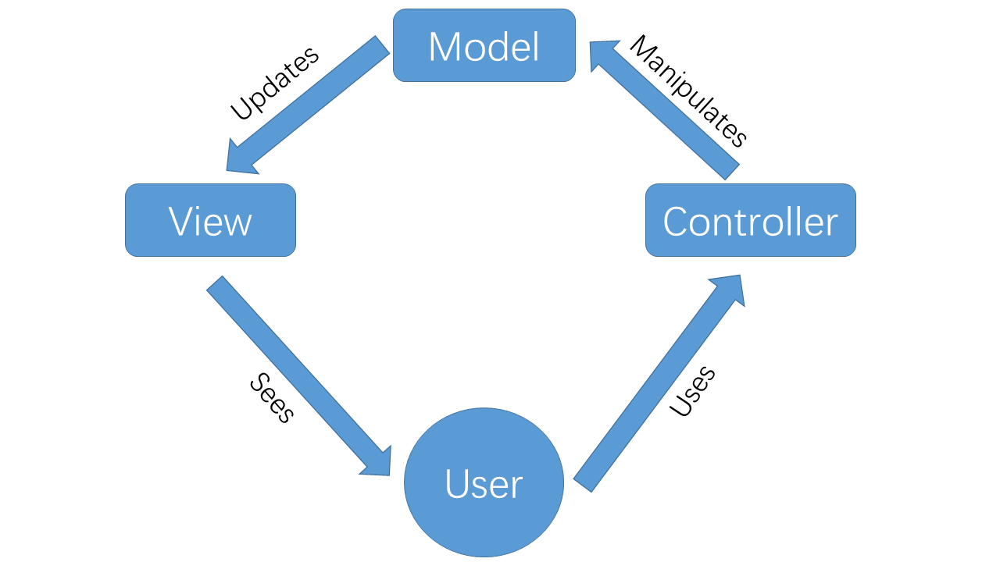
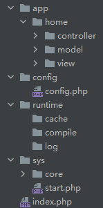

### PHP实现MVC框架
* MVC 运行原理
>模型（Model） 用于封装与应用程序的业务逻辑相关的数据以及对数据的处理方法。“ Model ”有对数据直接访问的权力，例如对数据库的访问。“Model”不依赖“View”和“Controller”，也就是说， Model 不关心它会被如何显示或是如何被操作。但是 Model 中数据的变化一般会通过一种刷新机制被公布。为了实现这种机制，那些用于监视此 Model 的 View 必须事先在此 Model 上注册，从而，View 可以了解在数据 Model 上发生的改变。
>
>视图（View）能够实现数据有目的的显示（理论上，这不是必需的）。在 View 中一般没有程序上的逻辑。为了实现 View 上的刷新功能，View 需要访问它监视的数据模型（Model），因此应该事先在被它监视的数据那里注册。
>
>控制器（Controller）起到不同层面间的组织作用，用于控制应用程序的流程。它处理事件并作出响应。“事件”包括用户的行为和数据 Model 上的改变。


* 参考框架和项目
  * Laravel5.2
  * ThinkPHP5
* 编码规范
> * 目录和文件:
>
> 目录不强制规范，驼峰及小写+下划线模式均支持；
>
> 类库、函数文件统一以.php为后缀；
>
> 类的文件名均以命名空间定义，并且命名空间的路径和类库文件所在路径一致；
>
> 类名和类文件名保持一致，统一采用驼峰法命名（首字母大写）；
>
> * 函数和类、属性命名:
>
> 函数的命名使用小写字母和下划线（小写字母开头）的方式，例如 get_client_ip；
>
> 方法的命名使用驼峰法，并且首字母小写，例如 getUserName；
>
> 属性的命名使用驼峰法，并且首字母小写，例如 tableName、instance；
>
> * 常量和配置:
>
> 常量以大写字母和下划线命名，例如 APP_PATH和 CORE_PATH；
>
> 配置参数以小写字母和下划线命名，例如 url_route_on 和url_convert
>
> * 数据表和字段:
>
> 数据表和字段采用小写加下划线方式命名，并注意字段名不要以下划线开头，例如 iframe_user 表和 iframe_name字段，不建议使用驼峰和中文作为数据表字段命名。

* 目录结构


* 新建数据表（user）
```
CREATE TABLE iframe_user(
    `id` INT(10) NOT NULL PRIMARY KEY AUTO_INCREMENT,
    `name` varchar(30) NOT NULL,
    `password` varchar(32) NOT NULL
);
INSERT INTO iframe_user (name,password) VALUES ('admin','admin');
```
* 测试 **php -S localhost:8080**