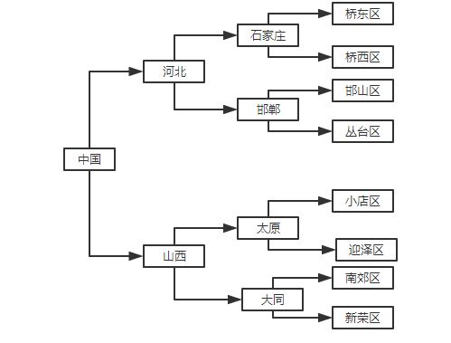

### PHP实现无限级分类
* 无限级分类技术在开发中经常使用，像我们的商城网的商品分类，部门结构，文章分类等等

---
* 创建数据库并导入测试数据
```
CREATE TABLE `category` (
    `id` int(11) NOT NULL AUTO_INCREMENT COMMENT '自动增长id',
    `pid` int(11) NOT NULL COMMENT '父id',
    `category` varchar(255) NOT NULL COMMENT '分类名称',
    `orderid` int(11) NOT NULL DEFAULT '0' COMMENT '排序id',
    PRIMARY KEY (`id`)
  ) ENGINE=InnoDB AUTO_INCREMENT=17 DEFAULT CHARSET=utf8;

 INSERT INTO `category` VALUES ('1', '0', '中国', '0');
 INSERT INTO `category` VALUES ('2', '1', '河北', '0');
 INSERT INTO `category` VALUES ('3', '1', '山西', '0');
 INSERT INTO `category` VALUES ('4', '2', '石家庄', '0');
 INSERT INTO `category` VALUES ('5', '2', '邯郸', '0');
 INSERT INTO `category` VALUES ('6', '3', '太原', '0');
 INSERT INTO `category` VALUES ('7', '3', '大同', '0');
 INSERT INTO `category` VALUES ('8', '4', '桥东', '0');
 INSERT INTO `category` VALUES ('9', '4', '桥西', '0');
 INSERT INTO `category` VALUES ('10', '5', '邯山', '0');
 INSERT INTO `category` VALUES ('11', '5', '丛台', '0');
 INSERT INTO `category` VALUES ('12', '6', '小店', '0');
 INSERT INTO `category` VALUES ('13', '6', '迎泽', '0');
 INSERT INTO `category` VALUES ('14', '7', '南郊', '0');
 INSERT INTO `category` VALUES ('15', '7', '新荣', '0');
``` 

* 启动 PHP 内置服务器 **php -S localhost:8080**
