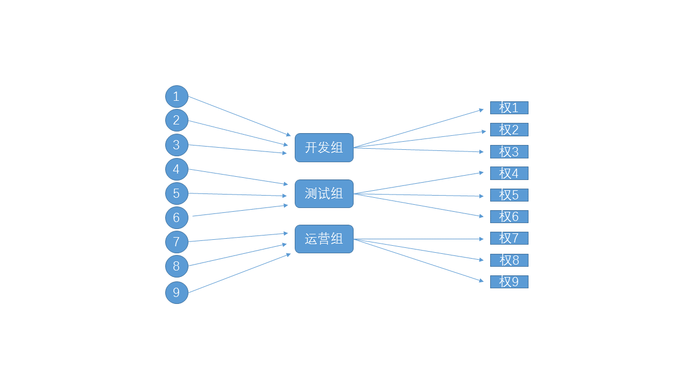
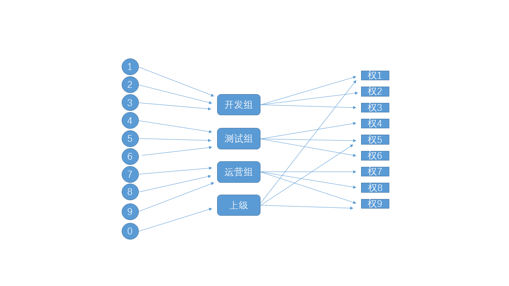
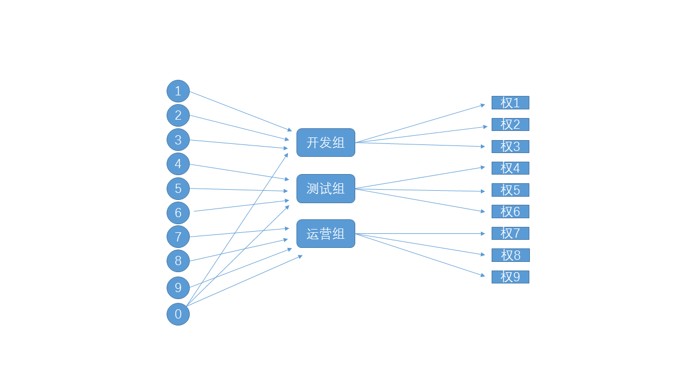

### 使用ThinkPHP-5.0 开发完成一个简易的后台权限管理系统，主要针对后台管理员之间的权限管理
* [TP5.0开发手册](https://www.kancloud.cn/manual/thinkphp5/118003)
* 关于权限管理的设计，目前比较主流的方案主要有两种：
  * 基于角色的访问控制（Role-Based Access Control）
  
  > 最左侧是不同的用户，中间是所属的不同角色，右侧是不同组所属的不同权限。通过这样的方式，就可以达到不同用户分配不同权限的目的。
    这样权限管理方式最大的特点就是一个用户只能属于一个角色，即一个用户组。这也是他最大的缺点，如果新增一个用户10 ，想要拥有 权限 1 、权限 5、权限 9，如果用 rbac，只能新增一个用户组，包含上述的权限。在实际应用中，这种情况非常常见，一个管理员可以管理很多模块。                                                          

  
  * 基于节点的权限管理系统（AUTH），主要用于 thinkphp
  > AUTH 其实只不过是对 RBAC 的一个改造，实现更加细节的权限管理。
    Auth 权限认证是按规则进行认证，我先说说它的原理。在数据库中我们有
    规则表（think_auth_rule）
    用户组表(think_auth_group)
    用户组明显表（think_auth_group_access）
    我们要判断用户是否有显示一个操作按钮的权限，首先定义一个规则，在规则表中添加一个名为 show_button 的规则。然后在用户组表添加一个用户组，定义这个用户组有 show_button 的权限规则（think_auth_group 表中 rules 字段存得时规则 ID，多个以逗号隔开），然后在用户组明细表定义 UID 为 1 的用户属于刚才这个的这个用户组。
    而且，auth 可以支持多角色对应，权限交叉的情况很好解决
  
                                                                                                                                                                                                                                                                                                                                                                                                                                                  >